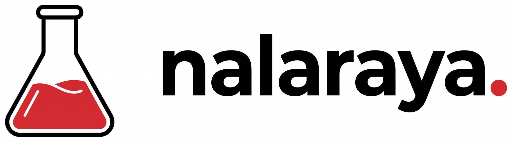

<p align="center">
  
</p>

# Nalaraya

Nalaraya adalah laboratorium virtual berbahasa Indonesia untuk belajar sains lewat percobaan. **Seluruh materi dan praktikum gratis, tanpa langganan berbayar.**

## Tiga alur pembelajaran

| Alur | Yang tersedia |
| --- | --- |
| **Kimia** | Pengenalan laboratorium serta simulasi titrasi asam–basa dengan latihan terpandu dan ujian. |
| **Biologi** | Pengamatan epidermis bawang merah, dari persiapan preparat hingga pengamatan mikroskopis. |
| **Fisika** | Segera hadir; belum ada praktikum fisika yang dapat dimainkan. |

Katalog dan materi pengantar dapat dibuka tanpa akun. Untuk masuk ke praktikum virtual dan menyimpan progres di dashboard, pengguna masuk melalui email atau Google, lalu menjawab tiga pertanyaan singkat saat pertama kali bergabung.

## Menjalankan secara lokal

Persyaratan: Node.js dan proyek Supabase yang telah dikonfigurasi.

```sh
npm install
cp .env.example .env.local
npm run dev
```

Isi `.env.local` dengan URL proyek dan publishable/anon key Supabase. Terapkan migrasi `supabase/migrations/20261002000000_auth_progress.sql`, lalu ikuti [panduan autentikasi](docs/auth-setup.md) untuk email, Google OAuth, dan redirect URL. Buka `http://localhost:3000`.

```sh
npm test
npm run build
```

## Contoh alur praktikum Kimia

Buka **Kimia → Titrasi asam–basa → Latihan**. Kenakan APD, susun statif dan buret, bilas serta isi buret, siapkan sampel HCl dan indikator, lalu lakukan titrasi sampai warna stabil. Catat pembacaan meniskus dan hitung molaritas. Mode ujian memberi batas waktu 10 menit dan tidak menampilkan panduan langkah. Progres latihan dan nilai ujian terbaik disimpan ke akun.

Simulasi memakai reaksi ideal HCl–NaOH. Endpoint direpresentasikan sebagai rentang 24,80–25,05 mL; gerak cairan dan preparasi disederhanakan untuk pembelajaran. Ini bukan pengganti pengawasan guru atau prosedur keselamatan laboratorium nyata. Lihat juga [sumber materi epidermis bawang](docs/epidermis-sources.md).

## Deployment

Deploy sebagai aplikasi Next.js, misalnya di Vercel, dengan perintah build `npm run build`. Setel `NEXT_PUBLIC_SUPABASE_URL` dan `NEXT_PUBLIC_SUPABASE_ANON_KEY` di lingkungan deployment, lalu tambahkan domain deployment ke URL redirect Supabase dan Google sesuai [panduan autentikasi](docs/auth-setup.md). Jangan menaruh service-role key di aplikasi.

## Kredit model 3D

Model berikut digunakan untuk pratinjau peralatan. Masing-masing ditautkan ke karya asli dan berlisensi [Creative Commons Attribution 4.0](https://creativecommons.org/licenses/by/4.0/).

| Model | Kreator | Sumber | Penyesuaian di Nalaraya |
| --- | --- | --- | --- |
| [CC0 - Funnel 3](https://sketchfab.com/3d-models/cc0-funnel-3-9c71ecea8e0941af9f0e7b59895f7fd4) | plaggy | Sketchfab | Digunakan sebagai pratinjau corong tanpa perubahan bentuk. |
| [Rubber Med Gloves (free to download)](https://sketchfab.com/3d-models/rubber-med-gloves-free-to-download-ef128b0efbb1461c8c0f37b83b5f17af) | KOMODOZ | Sketchfab | Tekstur pratinjau diperkecil dan data yang tidak terpakai dibersihkan. |
| [Glasses](https://sketchfab.com/3d-models/glasses-c3d6459e82d647bf990ff05173d9aecb) | vinigor | Sketchfab | Tekstur pratinjau diperkecil dan data yang tidak terpakai dibersihkan. |
| [Chemistry Glassware](https://sketchfab.com/3d-models/chemistry-glassware-b8594f7dc7e8442dbaaae7a11da4a962) | maxdragonn | Sketchfab | Node beker dan gelas ukur dipilih dari satu berkas GLB. |
| [Microscope](https://sketchfab.com/3d-models/microscope-2435e338bf7541a4b919e53df50eeeea) | VeeRuby Technologies Pvt Ltd | Sketchfab | Skala dan posisi disesuaikan saat ditampilkan dalam pratinjau. |

Judul **“CC0 - Funnel 3”** adalah judul karya; halaman model mencantumkan lisensi **CC BY 4.0**. Rincian perubahan aset tersedia di [catatan atribusi model](docs/model-attributions.md). Font Atkinson Hyperlegible menggunakan SIL OFL; pustaka Next.js, React, Three.js, React Three Fiber, dan Drei memakai lisensi masing-masing.
